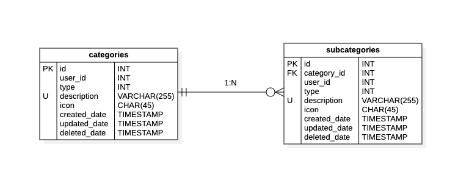

Para controlar mayor el __control de gastos__ podemos administrarlo en diferentes
Categorías, como __gastos generales__, __gastos de vivienda__, __gastos de servicios__,
etc.
Para administrar los __tipos de gastos__, se registrará en la tabla de categorías.

## 📄 Columnas

<table>
    <thead>
        <tr>
            <th>Columna</th>
            <th>Tipo</th>
            <th>Tamaño</th>
            <th>Nulo</th>
            <th>Único</th>
            <th>Auto incrementable</th>
            <th>Default</th>
            <th>Comentario</th>
        </tr>
    </thead>
    <tbody>
        <tr>
            <td><strong>id</strong></td>
            <td>INT</td>
            <td></td>
            <td>🚫</td>
            <td>✅</td>
            <td>✅</td>
            <td></td>
            <td>Clave primaria</td>
        </tr>
        <tr>
            <td><strong>user_id</strong></td>
            <td>INT</td>
            <td></td>
            <td>🚫</td>
            <td>🚫</td>
            <td>🚫</td>
            <td>0</td>
            <td>Identificador del usuario, que realiza la ultima operación</td>
        </tr>
        <tr>
            <td><strong>type</strong></td>
            <td>INT</td>
            <td></td>
            <td>🚫</td>
            <td>🚫</td>
            <td>🚫</td>
            <td>2</td>
            <td>
                Tipo: 
                1: ingreso 
                2: egreso
            </td>
        </tr>
        <tr>
            <td><strong>description</strong></td>
            <td>VARCHAR</td>
            <td>255</td>
            <td>🚫</td>
            <td>✅</td>
            <td>🚫</td>
            <td></td>
            <td></td>
        </tr>
        <tr>
            <td><strong>icon</strong></td>
            <td>CHAR</td>
            <td>45</td>
            <td>✅</td>
            <td>🚫</td>
            <td>🚫</td>
            <td>NULL</td>
            <td></td>
        </tr>
        <tr>
            <td><strong>created_date</strong></td>
            <td>TIMESTAMP</td>
            <td></td>
            <td>🚫</td>
            <td>🚫</td>
            <td>🚫</td>
            <td>NOW()</td>
            <td>Información de auditoria</td>
        </tr>
        <tr>
            <td><strong>updated_date</strong></td>
            <td>TIMESTAMP</td>
            <td></td>
            <td>✅</td>
            <td>🚫</td>
            <td>🚫</td>
            <td>NULL</td>
            <td>Información de auditoria</td>
        </tr>
        <tr>
            <td><strong>deleted_date</strong></td>
            <td>TIMESTAMP</td>
            <td></td>
            <td>✅</td>
            <td>🚫</td>
            <td>🚫</td>
            <td>NULL</td>
            <td>Información de auditoria</td>
        </tr>
    </tbody>
</table>

## 📑 Indexes

<table>
    <thead>
        <tr>
            <th>Restricción</th>
            <th>Tipo</th>
            <th>Campo</th>
        </tr>
    </thead>
    <tbody>
        <tr>
            <td>pk_account</td>
            <td>Primary Key</td>
            <td>id</td>
        </tr>
    </tbody>
</table>

## 🚏 Relaciones

