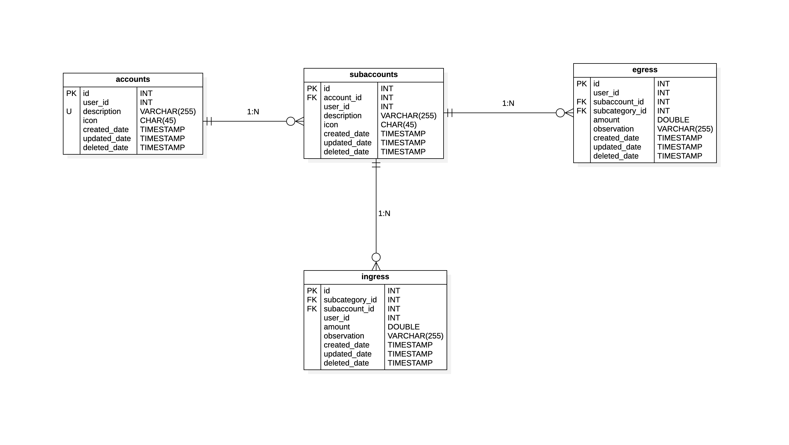

Como sabemos en una tarjeta de débito o crédito, podemos separar
nuestro dinero en diferentes apartados.
Cada banco lo nombra de diferente manera, pero el fin es el mismo.
con esta tabla represento esta operación.

## 📄 Columnas

<table>
    <thead>
        <tr>
            <th>Columna</th>
            <th>Tipo</th>
            <th>Tamaño</th>
            <th>nulo</th>
            <th>Auto incrementable</th>
            <th>Default</th>
            <th>Comentario</th>
        </tr>
    </thead>
    <tbody>
        <tr>
            <td><strong>id</strong></td>
            <td>INT</td>
            <td></td>
            <td>🚫</td>
            <td>✅</td>
            <td></td>
            <td>Clave primaria</td>
        </tr>
        <tr>
            <td><strong>account_id</strong></td>
            <td>INT</td>
            <td></td>
            <td>🚫</td>
            <td>🚫</td>
            <td></td>
            <td>Clave foráneo, de tabla cuenta</td>
        </tr>
        <tr>
            <td><strong>user_id</strong></td>
            <td>INT</td>
            <td></td>
            <td>🚫</td>
            <td>🚫</td>
            <td>0</td>
            <td>Identificador del usuario, que realiza la ultima operación</td>
        </tr>
        <tr>
            <td><strong>description</strong></td>
            <td>VARCHAR</td>
            <td>255</td>
            <td>🚫</td>
            <td>🚫</td>
            <td></td>
            <td></td>
        </tr>
        <tr>
            <td><strong>icon</strong></td>
            <td>CHAR</td>
            <td>45</td>
            <td>✅</td>
            <td>🚫</td>
            <td>NULL</td>
            <td></td>
        </tr>
        <tr>
            <td><strong>created_date</strong></td>
            <td>TIMESTAMP</td>
            <td></td>
            <td>🚫</td>
            <td>🚫</td>
            <td>NOW()</td>
            <td>Información de auditoria</td>
        </tr>
        <tr>
            <td><strong>updated_date</strong></td>
            <td>TIMESTAMP</td>
            <td></td>
            <td>✅</td>
            <td>🚫</td>
            <td>NULL</td>
            <td>Información de auditoria</td>
        </tr>
        <tr>
            <td><strong>deleted_date</strong></td>
            <td>TIMESTAMP</td>
            <td></td>
            <td>✅</td>
            <td>🚫</td>
            <td>NULL</td>
            <td>Información de auditoria</td>
        </tr>
    </tbody>
</table>

## 📑 Indexes

<table>
    <thead>
        <tr>
            <th>Restricción</th>
            <th>Tipo</th>
            <th>Campo</th>
        </tr>
    </thead>
    <tbody>
        <tr>
            <td>pk_subaccount</td>
            <td>Primary Key</td>
            <td>id</td>
        </tr>
        <tr>
            <td>fk_account_subaccount</td>
            <td>Foreign Key</td>
            <td>account_id</td>
        </tr>
    </tbody>
</table>

## 🚏 Relaciones

