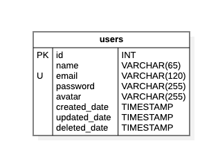

En está tabla se registrarán los usuarios del sistema.

:::info
Por cada base de datos solo se podrá registrará 10 usuarios.
:::

## 📄 Columnas

<table>
    <thead>
        <tr>
            <th>Columna</th>
            <th>Tipo</th>
            <th>Tamaño</th>
            <th>Nulo</th>
            <th>Único</th>
            <th>Auto incrementable</th>
            <th>Default</th>
            <th>Comentario</th>
        </tr>
    </thead>
    <tbody>
        <tr>
            <td><strong>id</strong></td>
            <td>INT</td>
            <td></td>
            <td>🚫</td>
            <td>✅</td>
            <td>✅</td>
            <td></td>
            <td>Clave primaria</td>
        </tr>
        <tr>
            <td><strong>name</strong></td>
            <td>VARCHAR</td>
            <td>65</td>
            <td>🚫</td>
            <td>🚫</td>
            <td>🚫</td>
            <td></td>
            <td></td>
        </tr>
        <tr>
            <td><strong>email</strong></td>
            <td>VARCHAR</td>
            <td>120</td>
            <td>🚫</td>
            <td>✅</td>
            <td>🚫</td>
            <td></td>
            <td></td>
        </tr>
        <tr>
            <td><strong>password</strong></td>
            <td>VARCHAR</td>
            <td>225</td>
            <td>🚫</td>
            <td>🚫</td>
            <td>🚫</td>
            <td></td>
            <td></td>
        </tr>
        <tr>
            <td><strong>avatar</strong></td>
            <td>VARCHAR</td>
            <td>225</td>
            <td>✅</td>
            <td>🚫</td>
            <td>🚫</td>
            <td></td>
            <td></td>
        </tr>
        <tr>
            <td><strong>created_date</strong></td>
            <td>TIMESTAMP</td>
            <td></td>
            <td>🚫</td>
            <td>🚫</td>
            <td>🚫</td>
            <td>NOW()</td>
            <td>Información de auditoria</td>
        </tr>
        <tr>
            <td><strong>updated_date</strong></td>
            <td>TIMESTAMP</td>
            <td></td>
            <td>✅</td>
            <td>🚫</td>
            <td>🚫</td>
            <td>NULL</td>
            <td>Información de auditoria</td>
        </tr>
        <tr>
            <td><strong>deleted_date</strong></td>
            <td>TIMESTAMP</td>
            <td></td>
            <td>✅</td>
            <td>🚫</td>
            <td>🚫</td>
            <td>NULL</td>
            <td>Información de auditoria</td>
        </tr>
    </tbody>
</table>

## 📑 Indexes

<table>
    <thead>
        <tr>
            <th>Restricción</th>
            <th>Tipo</th>
            <th>Campo</th>
        </tr>
    </thead>
    <tbody>
    </tbody>
</table>

## 🚏 Relaciones

