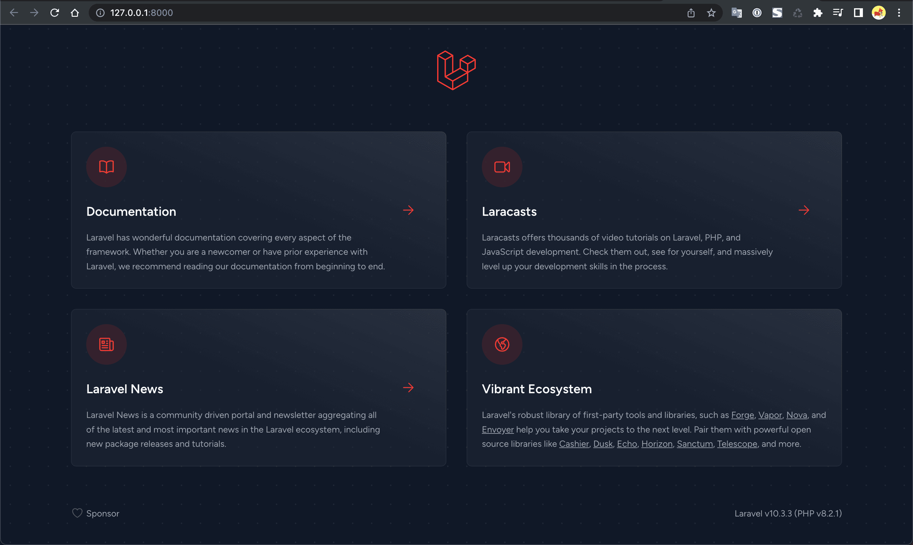

Antes de realizar la instalación hay que asegurarnos que en nuestro equipo 
tengamos instalado __PHP__ y __Composer__, Puedes revisar el __post anterior__,
[aquí](./environment-local.mdx). Si estás utilizando MacOS puedes realizar la
instalación mediante [HomeBrew](https://brew.sh/index_es).

Después de haber instalado __PHP__ y __Composer__, procedemos a la instalación
de un proyecto de __Laravel__ mediante __Composer__, usando el siguiente comando.

:::info 🛠️ Terminal

Este comando debe se ejecutado desde la linea de comando.

:::

```bash
composer create-project laravel/laravel example-app
```

Otra manera de crear un proyecto es instalando __Laravel__ de forma __global__, de
la siguiente manera.

```bash
composer global require laravel/installer
```

Y cada vez que se requiera crear un proyecto usamos el siguiente comando.

```bash
laravel new example-app
```

Después de haber creado el proyecto, accedemos y corremos el servidor integrado.

```bash
cd example-app
 
php artisan serve
```

Al ejecutar el comando __php artisan serve__ se abrirá una nueva ventana en nuestro
__navegador web__ predeterminado. Como se puede ver a continuación.


