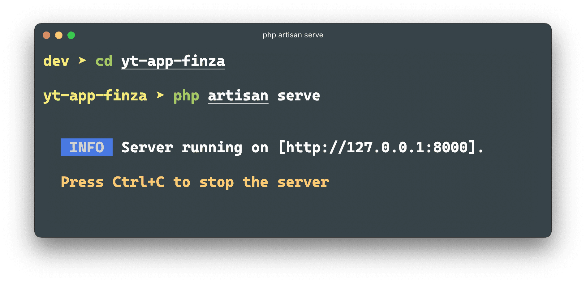
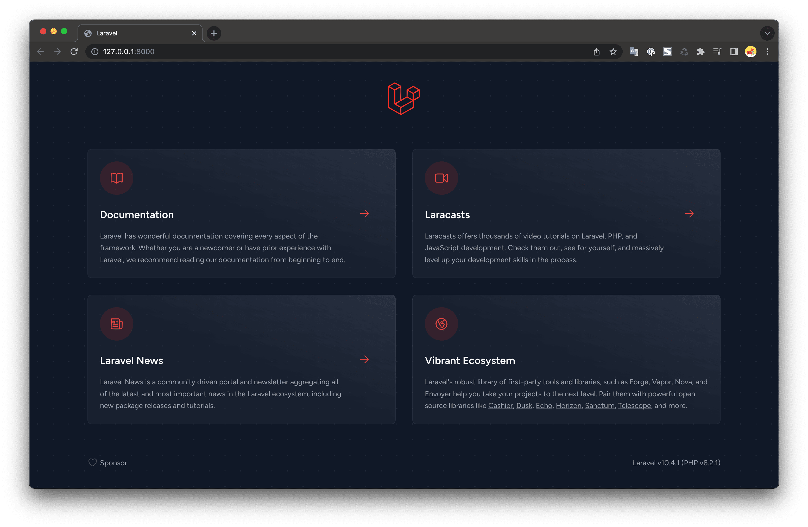
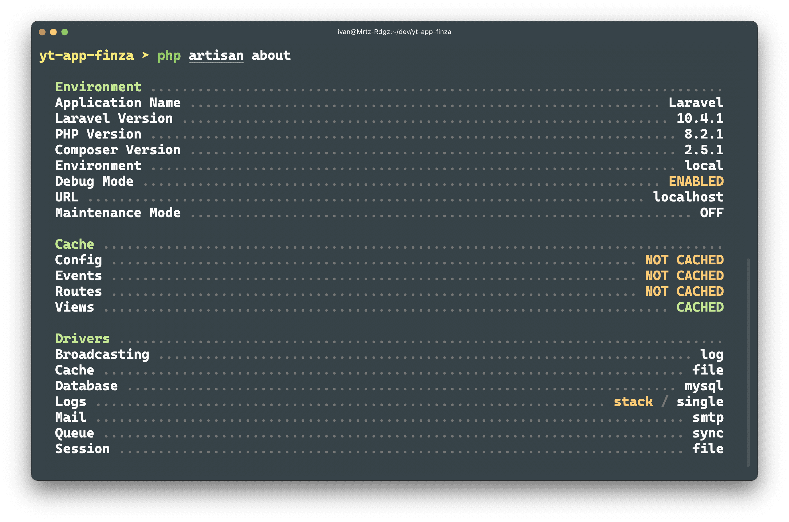

Para crear un proyecto de __Laravel__, necesitamos tener
como mínimo la versión __8.1 de PHP__ y tener instalado __composer__

:::info Composer

Puede seguir los pasos de instalación de __composer__ desde su
__Página oficial__,
de click [aquí](https://getcomposer.org/download/)

:::

## 🛠️ Instalación de Laravel

Para crear un proyecto de __Laravel__, usaremos el gestor de dependencias
__composer__, abrimos una terminal e ingresamos el siguiente comando.

```bash
composer create-project laravel/laravel yt-app-finza
```

En donde ___yt-app-finza___, es el nombre que tendrá el proyecto de __Laravel__.

## 🚀 Iniciar servidor local de Laravel

Después de haber creado el proyecto, debemos iniciar el servidor de desarrollo
local de laravel, usando los comandos del __CLI Artisan__ de __Laravel__.

```bash
cd yt-app-finza

php artisan serve
```

Una vez iniciado el servidor, podremos visitar el siguiente link http:://127.0.0.1:8000





## 🖼️ Descripción general de la aplicación

Para ver rápidamente las características de nuestra aplicación, podemos usar el siguiente
comando.

```bash
php artisan about
```


