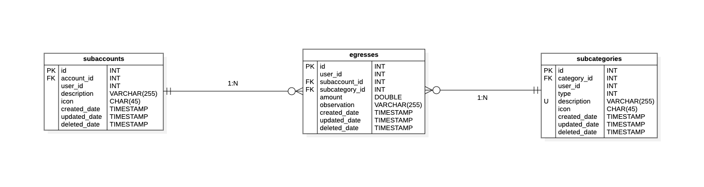

Esta tabla registrará todas las operaciones de salida de efectivo.

## 📄 Columnas

<table>
    <thead>
        <tr>
            <th>Columna</th>
            <th>Tipo</th>
            <th>Tamaño</th>
            <th>Nulo</th>
            <th>Único</th>
            <th>Auto incrementable</th>
            <th>Default</th>
            <th>Comentario</th>
        </tr>
    </thead>
    <tbody>
        <tr>
            <td><strong>id</strong></td>
            <td>INT</td>
            <td></td>
            <td>🚫</td>
            <td>✅</td>
            <td>✅</td>
            <td></td>
            <td>Clave primaria</td>
        </tr>
        <tr>
            <td><strong>subaccount_id</strong></td>
            <td>INT</td>
            <td></td>
            <td>🚫</td>
            <td>🚫</td>
            <td>🚫</td>
            <td></td>
            <td>Clave foráneo de tabla subcuenta</td>
        </tr>
        <tr>
            <td><strong>subcategory_id</strong></td>
            <td>INT</td>
            <td></td>
            <td>🚫</td>
            <td>🚫</td>
            <td>🚫</td>
            <td></td>
            <td>Clave foráneo de tabla subcategoría</td>
        </tr>
        <tr>
            <td><strong>user_id</strong></td>
            <td>INT</td>
            <td></td>
            <td>🚫</td>
            <td>🚫</td>
            <td>🚫</td>
            <td></td>
            <td>Identificador del usuario, que realiza la ultima operación</td>
        </tr>
        <tr>
            <td><strong>amount</strong></td>
            <td>DOUBLE</td>
            <td></td>
            <td>🚫</td>
            <td>🚫</td>
            <td>🚫</td>
            <td></td>
            <td></td>
        </tr>
        <tr>
            <td><strong>observation</strong></td>
            <td>VARCHAR</td>
            <td>255</td>
            <td>✅</td>
            <td>🚫</td>
            <td>🚫</td>
            <td></td>
            <td></td>
        </tr>
        <tr>
            <td><strong>created_date</strong></td>
            <td>TIMESTAMP</td>
            <td></td>
            <td>🚫</td>
            <td>🚫</td>
            <td>🚫</td>
            <td>NOW()</td>
            <td>Información de auditoria</td>
        </tr>
        <tr>
            <td><strong>updated_date</strong></td>
            <td>TIMESTAMP</td>
            <td></td>
            <td>✅</td>
            <td>🚫</td>
            <td>🚫</td>
            <td>NULL</td>
            <td>Información de auditoria</td>
        </tr>
        <tr>
            <td><strong>deleted_date</strong></td>
            <td>TIMESTAMP</td>
            <td></td>
            <td>✅</td>
            <td>🚫</td>
            <td>🚫</td>
            <td>NULL</td>
            <td>Información de auditoria</td>
        </tr>
    </tbody>
</table>

## 📑 Indexes

<table>
    <thead>
        <tr>
            <th>Restricción</th>
            <th>Tipo</th>
            <th>Campo</th>
        </tr>
    </thead>
    <tbody>
        <tr>
            <td>pk_egress</td>
            <td>Primary Key</td>
            <td>id</td>
        </tr>
        <tr>
            <td>fk_subaccount_egress</td>
            <td>Foreign Key</td>
            <td>subaccount_id</td>
        </tr>
        <tr>
            <td>fk_subcategory_egress</td>
            <td>Foreign Key</td>
            <td>subcategory_id</td>
        </tr>
    </tbody>
</table>

## 🚏 Relaciones

