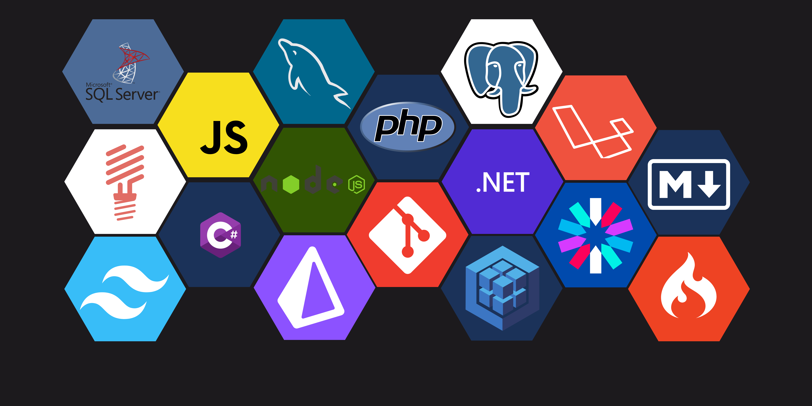

<h1>👋 Hola!, Soy Ivan Martinez 👨‍💻!</h1>
<h2>🚀 Desarrollador <strong>backend</strong> de México 🇲🇽</h2>

---

<h3>⚒️ Lenguajes:</h3>

<h3>🛫 Framework PHP:</h3>

<h3>⚱️ Framework CSS:</h3>

 

<h3>🖥️ Entornos:</h3>

<h3>📦 Bases de datos:</h3>

<h3>🚦 Sistemas operativos:</h3>

<h3>🔗 Otros:</h3>

 

---

<!--
**igmr/igmr** is a ✨ _special_ ✨ repository because its `README.md` (this file) appears on your GitHub profile.

Here are some ideas to get you started:

- 🔭 I’m currently working on ...
- 🌱 I’m currently learning ...
- 👯 I’m looking to collaborate on ...
- 🤔 I’m looking for help with ...
- 💬 Ask me about ...
- 📫 How to reach me: ...
- 😄 Pronouns: ...
- ⚡ Fun fact: ...
-->
